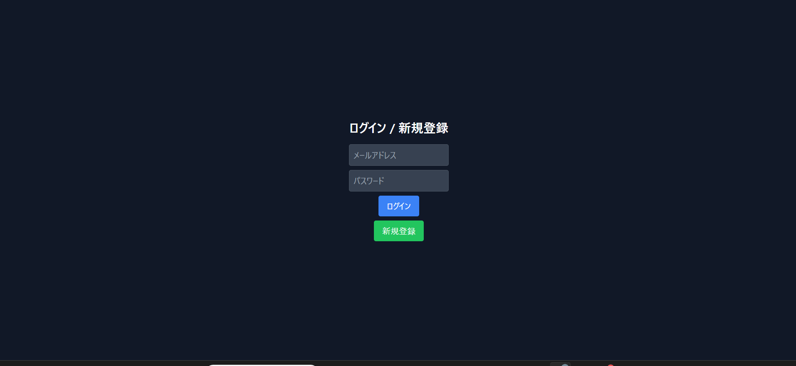
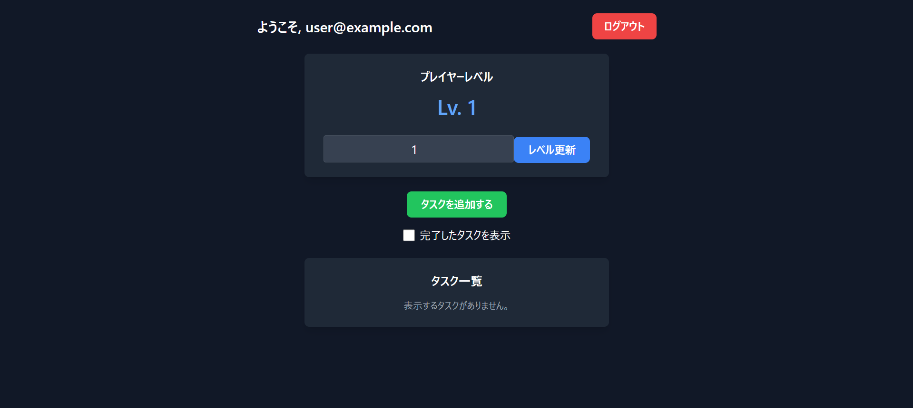
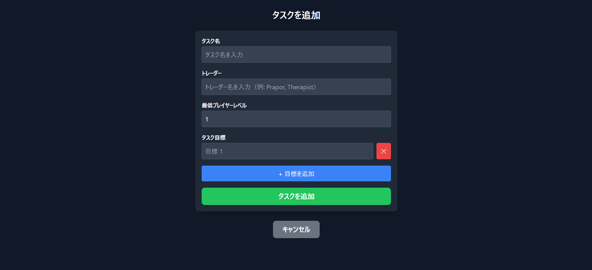

# Escape from Tarkov タスク管理アプリ
https://tarkov-task-todo.vercel.app/
2025/2作成。
## はじめに
### Escape from Tarkovとは
『Escape from Tarkov』（以下、Tarkov）は、FPSとRPG要素を融合させたリアル志向のシューティングゲーム。このWebアプリは、Tarkovのタスク（ミッション）を管理することを目的としており、ユーザが進捗状況や目標達成度を一目で把握できるように設計した。

### 背景と開発経緯
当初は[TarkovAPI](https://tarkov.dev/api?lng=ja)を利用してタスク情報を自動取得し、表示する仕組みを実装する予定であった。しかし、個人の技術レベルが足りないことや時間的な制約も相まって現状の手動タスク管理アプリとしての形に落ち着いた。

## プロジェクト概要
このプロジェクトは、Tarkovのタスクを効率的に管理するためのWebアプリです。ユーザはタスクの追加、編集、削除を操作でき、各タスクの進捗状況やプレイヤーレベルに応じたタスクの表示制御が可能。

## 主な機能
- ユーザー認証
Supabaseを利用したメールアドレスを用いたログイン・ログアウト機能による、セキュアなユーザー管理

## 実際に動かす
### 1.ログイン・新規登録
https://tarkov-task-todo.vercel.app/にログインしていない時にアクセスするとhttps://tarkov-task-todo.vercel.app/authにリダイレクトされます。

フォームに登録されていないメールアドレスとパスワードを入れるとSupabaseに保存されてログインできます。二回目以降はそのままメールアドレスとパスワードを入れるとログインできます。
### 2.ダッシュボード
ログインすると以下の画面（/dashboard）に遷移します。

#### プレイヤーレベルの管理:
現在のレベルを表示
数値を変更し「レベル更新」ボタンを押すことで、レベルを更新

#### タスク一覧の表示:
自身のタスクを確認可能
必要レベルが達していないタスクは薄く表示

#### タスクの管理:
「タスクを追加する」ボタンで新しいタスクを登録可能
各タスクの詳細を開き、内容の編集や削除が可能

#### 完了タスクの表示/非表示:
トグルボタンで完了済みのタスクを非表示にする機能
- **タスク管理**

    - タスクの追加、編集、削除機能
    - タスクの詳細表示（説明、期限、進捗状況など）
    - 各目標の達成状況の管理と更新
    - 完了タスクの表示・非表示切替機能
- **プレイヤーレベル管理**

    - ユーザーがレベルを手動で更新可能
    - レベルに応じたタスク表示の自動制御
- **データ同期**
    - Supabaseとの連携によるクラウド上でのタスク情報管理
    - 複数デバイス間でのデータ一貫性の確保
## 技術スタック
フロントエンド: Next.js, TypeScript, Tailwind CSS
バックエンド: Supabase（PostgreSQL, Auth, Storage）
デプロイ: Vercel

## 今後の改善予定と拡張機能
前述のTarkovAPIを利用してタスクの自動取得
タスク並び替えおよび検索機能: トレーダーやレベルでの並び替えを用いてユーザが目的のタスクを素早く見つけられるよう改善
Tarkov Wikiとの連携: アイテムの情報やタスク詳細をそのままリンクする
## 開発を通じて学んだこと
本アプリの開発では、Next.jsを用いたフロントエンド開発、TypeScriptによる型安全なコード設計、そしてSupabaseを使ったクラウドデータ管理の基礎を実践的に学ぶことができた。
## ライセンス
MIT License